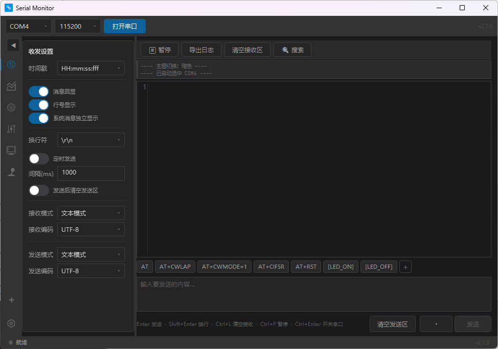
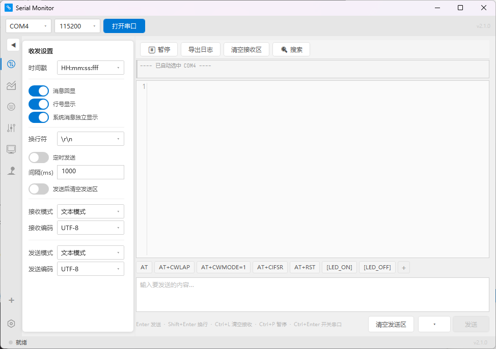

<h1 align="center">
  
  <br>
  Serial Monitor V2
  <br>
</h1>

<h3 align="center">
基于 WPF + AvalonEdit + OxyPlot 的串口调试工具。
<br>STM32 端配套 C 库，扔进工程即用。
</h3>

<p align="center">
  Languages:
  <a href="./README.md">简体中文</a> ·
  <a href="./docs/README_en.md">English</a>
</p>


## Preview

| 🌙 暗色主题 | ☀️ 亮色主题 |
|:-----------:|:-----------:|
|  |  |

## Install

> 请到 [Release 页面](https://github.com/Encaron/SerialMonitor/releases) 下载最新安装包。

1. 下载 `SerialMonitor-Setup-vX.X.X.exe`
2. 双击运行，按提示完成安装
3. 安装器会自动检测并安装 .NET 8 运行时（如未安装）
4. 安装完成后桌面和开始菜单均有快捷方式

仅支持 **Windows 10+（x64）**。

## Features

### 串口核心
- 动态扫描串口、17 种预设 + 自定义波特率
- HEX / 文本双模式收发、UTF-8 / GBK 编码
- 硬件流控（RTS/CTS、XON/XOFF）、DTR/RTS 控制信号
- USB 热插拔自动检测 + 自动重连
- TX/RX 流量统计

### 接收区
- AvalonEdit 虚拟化渲染，高频数据不掉帧
- 彩色日志（系统消息 / 发送回显 / 接收数据，三色区分）
- 时间戳（三种格式）、行号跟随主题
- 智能滚屏锁定、暂停显示 + 缓冲满提醒
- Ctrl+F 搜索（关键字 / 正则 / 大小写敏感）
- 日志导出

### 发送区
- 快捷发送面板（chip 按钮 + 右键编辑删除 + 预置 AT 指令）
- 发送历史（最近 20 条去重）
- HEX 实时格式化、定时发送
- 换行符可选（\r\n / \n / \r / 无）
- Enter = 发送 / Shift+Enter = 换行

### 📈 波形图面板
- OxyPlot 实时曲线，通道名自动成为图例
- 滚动 / 扫描双模式，30Hz 刷新限流
- 数值 HUD 半透明叠加、标点 / 连线可切换
- 信号分析：频率 / 幅值 / 占空比 / 波形类型识别
- CSV 导出、Y 轴手动 / 自动范围

### 🎮 控制面板（双向通信）
| 面板 | 协议格式 | 说明 |
|:----:|---------|------|
| 按键 | `[key,name,state]` | 6 种键盘布局预设 + 自定义按键，颜色可调，支持批量编辑 |
| 滑杆 | `[slider,name,val]` | 自定义颜色轨道 + 拇指，拖拽实时回控 STM32 |
| 摇杆 | `[joystick,id,x1,y1,x2,y2]` | 3 种内置风格（手柄/极简/经典）+ 自定义图片素材 |
| OLED | `[display,x,y,text,size,#color]` | 虚拟 OLED 屏幕，支持彩色文字渲染 |

### 🎨 主题与动效
- VS Code Dark+ 风格主题，暗色/亮色一键切换
- 21 色 DynamicResource 全量覆盖
- 按键调色盘（40 色 Material Design 色板 + hex 自定义）
- 弹性动画（按键脉冲 / 滑杆缩弹 / 图标抖动）

### 🛡️ 健壮性
- 三个致命路径（后台 Read / 发送 Write / 协议路由）全部 try-catch 保护
- 串口打开 5 层异常分类，中文错误提示
- 崩溃日志自动写入 `%LocalAppData%\SerialMonitor\crash.log`
- ProtocolParser 15 条单元测试

## Protocol Format

STM32 通过串口发送协议数据，软件零配置自动识别通道名：

```c
// PID 调参
Serial_Printf(&huart1, "[plot,P,%f][plot,I,%f][plot,D,%f]\r\n", p, i, d);
Serial_Printf(&huart1, "[slider,kp,%f]\r\n", kp_slider_value);

// 加速度计
Serial_Printf(&huart1, "[plot,ax,%f][plot,ay,%f][plot,az,%f]\r\n", ax, ay, az);
// 三条曲线自动创建，名字自动成为图例，颜色自动分配

// 按键/OLED
Serial_Printf(&huart1, "[key,btn1,down][display,0,0,\"Hello\",18]\r\n");
```

## 🔧 STM32 端 C 库（开箱即用）

不想自己写串口代码？[`Serial_C_Language/`](Serial_C_Language/) 提供了完整的 STM32 HAL 串口库——两个文件，扔进 CubeMX 工程即可。

**三步上手：**

```c
// ① 启动接收（方括号协议，专为 Serial Monitor V2 设计）
UART_InitReceive(SERIAL_DEVICE_1, SERIAL_PROTOCOL, SERIAL_SQUARE_BRACKET);

// ② MCU 主动上报 → PC 端自动建卡
Serial_Printf(&huart1, "[sensor,temp,芯片温度,%.1f]\r\n", 42.5);
Serial_Printf(&huart1, "[sensor,status,主板,online]\r\n");

// ③ PC 端开关卡 → STM32 控制硬件
if (strcmp(type, "ctrl") == 0) {
    HAL_GPIO_WritePin(GPIOA, GPIO_PIN_5,
        strcmp(action, "on") == 0 ? GPIO_PIN_RESET : GPIO_PIN_SET);
}
```

**配套内容：**

| 文件 | 说明 |
|------|------|
| [`Serial.c`](Serial_C_Language/Serial.c) + [`Serial.h`](Serial_C_Language/Serial.h) | 发送(6个) + 接收(4协议) + 中断回调，零依赖零 malloc |
| [`README.md`](Serial_C_Language/README.md) | 完整文档：快速入门、API 速查、接收处理示例、路由分发架构 |
| [`example/`](Serial_C_Language/example/) | 最小可编译 STM32CubeIDE 工程：波形发生器(9种) + 按键 + OLED 虚拟屏 + PWM 滑杆 |

> ⚠️ **本工程基于 STM32H743。** 若使用其他系列（F1/F4/G0/L4 等），需在 CubeMX 中更换芯片 → 重新生成 → 保留 `HardWare/` 目录即可。串口库本身与芯片无关，HAL 通用。可交给 AI 辅助迁移。

## Development

### 环境要求
- [.NET 8 SDK](https://dotnet.microsoft.com/download/dotnet/8.0)（8.0.422）
- Windows 10+ x64

### 编译

```bash
git clone https://github.com/Encaron/SerialMonitor.git
cd SerialMonitor/"Serial Monitor V2"
dotnet publish -c Release
```

输出：`bin/Release/net8.0-windows/win-x64/publish/Serial Monitor.exe`

### 运行测试

```bash
dotnet test SerialMonitor.Tests/SerialMonitor.Tests.csproj
```

## Roadmap

> 📋 详细方案见 [`Docs/Serial V2 修缮/开发计划2.md`](Docs/Serial%20V2%20修缮/开发计划2.md)。有想法？欢迎 [提交 Issue](https://github.com/Encaron/SerialMonitor/issues/new)。

### 📦 版本路线

| 版本 | 内容 | 说明 |
|------|------|------|
| ✅ **v2.2.0** | 🔴 全部 5 条快速改进 | Bug 修复 + 体验提升：拖拽不卡、HEX 提醒、波形冻结、版本号、侧栏充实 |
| **v2.3.0** | 🟡 调参工作台 + FFT 频谱 | 拖滑杆同时看波形 + 频域频谱分析 |
| **v2.4.0** | 🟡 传感面板 | 模块化卡片式 UI：5 类传感卡片 + 迷你波形 + 开关控制 |
| **v2.5.0** | 🟡 OLED 绘图 + PC 画板 | 绘图指令 + PC 端绘制 → STM32 物理屏 |
| **v2.6.0** | 🟢 内部优化 | i18n 预埋 + 路由抽出 + 主题优化，为英文版铺路 |

### 🔴 快速改进（v2.2.0）

| # | 计划 | 难度 |
|:--:|------|:--:|
| 1 | **绘图期间拖拽滑杆不卡**——不可见时跳过渲染 + 同屏时调度法让路，封堵全部卡顿场景 | 小 |
| 2 | **发送区 HEX 非法字符实时提醒**——发送含无效 HEX 时按钮旁显示 `⚠ 无效字符: G` | 极小 |
| 3 | **串口断开波形冻结保留**——关串口后波形不清空，叠加"串口已断开 · 数据冻结"水印 | 小 |
| 4 | **版本号自动注入**——csproj `<Version>` 自动同步到关于页 | 极小 |
| 5 | **滑杆/摇杆侧栏内容充实**——快速预设按钮 + 拖拽实时详情 + 摇杆反馈一致性修复 | 小 |

### 🟡 功能扩展（新标签页 / 新协议）

| # | 计划 | 难度 |
|:--:|------|:--:|
| 6 | **OLED 绘图指令**——`[draw,...]` 协议：画点/线/圆/矩形/色块填充 | 中 |
| 7 | **✏ PC 画板 → STM32 物理屏**——PC 端绘制 + 工具栏 → `[draw,...]` → STM32 屏显示 + 导出 C 数组 | 中 |
| 8 | **📊 调参工作台**——Plot 底部抽屉，拖滑杆同时看波形，模拟"手拧电位器 + 眼看示波器" | 中 |
| 10 | **📶 音频频谱页**——STM32 CMSIS-DSP FFT → `[fft,...]` → OxyPlot 频谱瀑布图 | 中 |
| 19 | **📡 传感面板**——模块化卡片式 UI：温度/湿度/气压/状态/开关卡片 + 迷你波形 + `[sensor,...]` `[ctrl,...]` 协议 | 中 |

### 🟢 打磨优化（UI 精致化 / 架构改进）

| # | 计划 | 难度 |
|:--:|------|:--:|
| 11 | **i18n 预埋**——逻辑值与显示文字分家，为未来中英双语铺路 | 中 |
| 15 | **面板路由抽出**——handler 函数体移入 ViewModel，路由 switch 保留，`RouteMessage` 为活接头 | 中 |
| 16 | **主题切换刷新优化**——遍历换色不重建结构，消除切主题闪烁 | 小 |

### 🔵 远期创意

| # | 想法 |
|:--:|------|
| 17 | NFC 标签页——`[nfc,...]` 门禁/电子标签调试 |
| 18 | 自动化宏录制——操作序列录制回放 |

### ⬜ 明确不做

- 多串口（协议系统本身是答案，真需要时开两个 exe）
- macOS 1:1 仿冒（WPF 投入产出极差）
- CI/CD（双击 exe 就够了）
- DI 容器（个人项目不需要）

## Repo Structure

| 目录 | 用途 |
|------|------|
| [`Serial Monitor V2/`](Serial%20Monitor%20V2/) | 🚀 主程序——WPF .NET 8，当前活跃开发目录 |
| [`Serial_C_Language/`](Serial_C_Language/) | 🔧 STM32 HAL 配套 C 库（详见[上方文档](#-stm32-端-c-库开箱即用)） |
| [`SerialMonitor.Tests/`](SerialMonitor.Tests/) | 🧪 单元测试（72 条） |
| [`Installer/`](Installer/) | 📦 Inno Setup 安装包脚本 |
| [`串口助手/`](%E4%B8%B2%E5%8F%A3%E5%8A%A9%E6%89%8B/) | 📦 江科大 WinForms 原版——历史存档，只读 |
| [`串口助手-WPF-v1/`](%E4%B8%B2%E5%8F%A3%E5%8A%A9%E6%89%8B-WPF-v1/) | 📦 v1.0.0 WPF 初版——历史存档，只读 |

## FAQ

**Q: 软件启动提示缺少 .NET 运行时？**
A: 安装 .NET 8 Desktop Runtime，[点击下载](https://dotnet.microsoft.com/download/dotnet/8.0)。使用安装包安装会自动处理。

**Q: 串口列表为空？**
A: 确认设备已连接、驱动已安装。部分 USB 转串口芯片需要手动安装驱动（CH340/CP2102）。

**Q: 如何反馈问题？**
A: 请在 [Issues](https://github.com/Encaron/SerialMonitor/issues) 提交，附上串口参数、操作步骤和截图。

## License

[MIT](LICENSE) © 2026 冯毅力 (Encaron)
